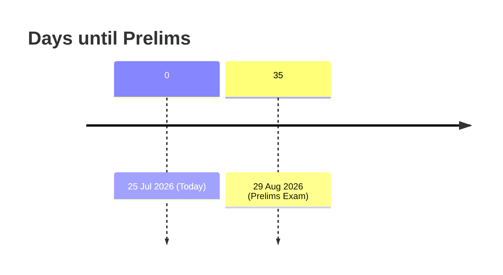
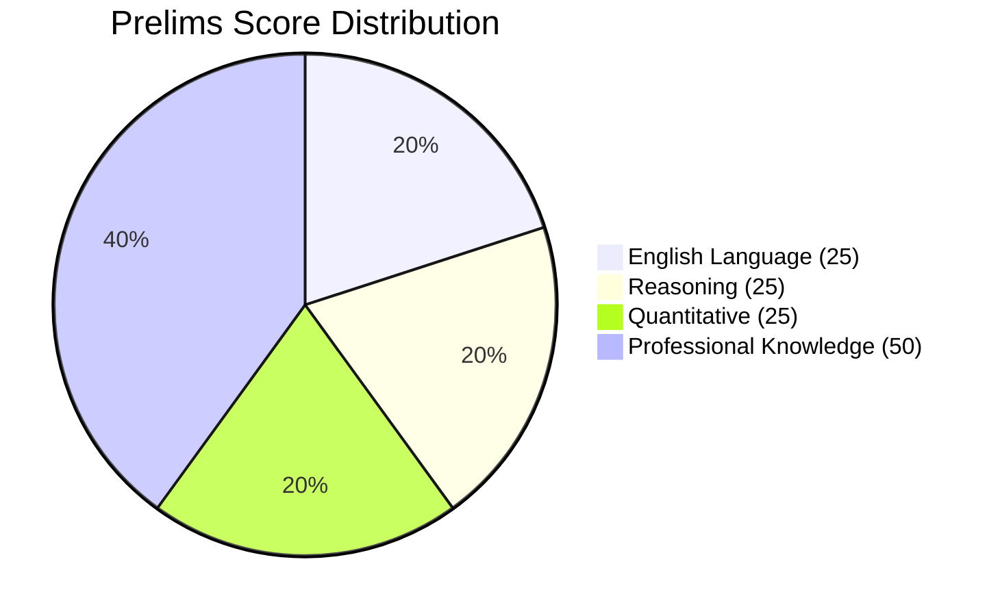

# Executive Summary  
The IBPS SO (Specialist Officer) CRP-SPL-XVI IT Officer (Scale I) Preliminary Exam is scheduled for **29 August 2026**, which is **35 days** from today (25 July 2026).  The Prelims is a qualifying, computer-based test with **4 sections** – English Language, Reasoning, Quantitative Aptitude, and Professional Knowledge (IT).  Each section has fixed timing (20 min each), for a total of **100 questions** and **125 marks** (80 minutes).  All questions are objective (MCQs) with one mark each (Professional Knowledge questions carry 2 marks each) and **0.25 marks deducted per wrong answer**.  The exam is bilingual (English & Hindi for all except the English section). Key high-weight topics include **Data Structures & Algorithms, DBMS, Operating Systems, Computer Networks**, etc. for the Professional Knowledge paper; in aptitude, **Arithmetic (percentage, profit/loss, time-work) and Data Interpretation** are crucial; in reasoning, puzzles and seating arrangements are high-yield; and in English, **Reading Comprehension and vocabulary/grammar** dominate. We propose a focused **35–40 day study plan** (daily schedule plus weekly goals) geared to a B.Tech CSE (AI/ML) background, emphasizing Professional Knowledge and regular mock tests.  Exam-day strategy covers smart time use per section, educated guesswork rules, and a checklist of essential documents (admit card, photo ID, photos, etc.). All information is drawn from IBPS notifications and trusted exam-prep sources.  

## 1. Exam Date and Countdown  
- **Prelims Date:** 29 August 2026 (IBPS SO notification).  That is roughly **35 days** from 25 July 2026.  
- **Mains Date:** 1 November 2026 (roughly 10 weeks after Prelims).  
- **Interview:** Date to be announced later. (Final merit = 80% Mains + 20% Interview.)  

| Stage        | Exam Date         | Sections (Prelims)                              | Questions | Total Marks | Duration  |
|--------------|-------------------|-------------------------------------------------|----------:|-----------:|----------:|
| Preliminary  | 29 Aug 2026  | English Language, Reasoning, Quantitative Aptitude, Professional Knowledge (IT) | 100 (25 each) | 125 (25+25+25+50) | 80 min (20 min/section) |
| Main         | 1 Nov 2026   | English Language, Reasoning, Quantitative Aptitude, Professional Knowledge (IT) | 150 (30+40+30+50) | 200 (30+40+30+100) | 125 min (sectional timing) |
| Interview    | – (2026)         | Interview (technical + HR)                     | –         | 100         | –        |

*Each preliminary section has sectional timing (20 min each). Professional Knowledge carries highest weight (50 marks out of 125). A 0.25-mark penalty applies to wrong answers. The medium is English (only) for the English section; all other sections are bilingual (English/Hindi).*

## 2. Exam Format (Prelims)  
- **Sections:** 4 (English Language, Reasoning, Quantitative Aptitude, Professional Knowledge – IT).  
- **Questions:** 25 MCQs per section; total 100 questions.  
- **Marks:** English/Reasoning/Quant: 25 marks each (1 mark/Q); Professional Knowledge: 50 marks (2 marks/Q). Total = 125 marks.  
- **Duration:** 80 minutes total (20 minutes per section, cannot switch sections early).  
- **Question Type:** Objective MCQs (one correct answer each). Negative marking = –0.25 for wrong, 0 for unattempted.  
- **Language:** English section only in English; all other sections (Reasoning, Quant, Professional Knowledge) in English and Hindi.  

| Section               | Questions | Marks | Time (min) | Medium            |
|-----------------------|:---------:|:-----:|:----------:|:------------------|
| English Language      | 25        | 25    | 20         | English only |
| Reasoning Ability     | 25        | 25    | 20         | English/Hindi |
| Quantitative Aptitude | 25        | 25    | 20         | English/Hindi |
| Professional Knowledge (IT) | 25 | 50    | 20         | English/Hindi |
| **Total**             | **100**   | **125** | **80**     | –                 |

- **Important Points:** Each section is separately timed. All sections must meet sectional cutoffs to qualify. Prelims marks are *not* counted in final ranking (only qualifying), but one must pass all sections to sit for Mains.  

## 3. Detailed Syllabus & Sample Question Types

**English Language:** Tests comprehension, vocabulary, and grammar. Key topics include reading comprehension, cloze tests, error spotting/correction, sentence improvement, fill-in-the-blanks, para jumbles, phrase replacement, connectors, vocabulary (synonyms/antonyms, idioms), and grammar (tenses, prepositions, subject-verb agreement, voice, narration). *Example:* A passage-based question asking inference or tone; a cloze test asking to fill blanks; identify the incorrectly used preposition; correct a highlighted phrase, etc.

**Reasoning Ability:** Covers logical reasoning and analytical puzzles. Important topics include seating arrangements (linear, circular, square, double-row), puzzle sets (floor, box, scheduling, distribution, etc.), syllogisms (statements/conclusions), inequalities (direct/coded), coding-decoding (letters, numbers, symbols), blood relations, direction sense problems, ranking & order, series (alphabet/number), data sufficiency, and critical reasoning (cause-effect, assumption). *Example:* “A is to the left of B and in front of C, etc. Who sits opposite X?” (seating); “If P then Q, Q then R, what follows?” (syllogism); complex arrangement puzzle (pipes/floors), etc.

**Quantitative Aptitude:** Focuses on arithmetic, algebra, geometry, and data interpretation. Key topics include *Arithmetic* – percentages, profit & loss, discounts, simple & compound interest, ratio-proportion & mixtures, average, time & work (and pipes), time & distance (including trains, boats-streams), ages, partnership; *Advanced Math* – number systems, simplifications (BODMAS, approximations), surds & indices, algebra (linear/quadratic equations), geometry (triangles, circles, quadrilaterals), mensuration (2D/3D shapes); *Data Interpretation* – tables, pie/bar/line graphs, caselets, missing data, mixed graphs. *Example:* “A+B coin triples, interest at 10% per annum, find final amount.” (interest); “Graph shows sales – find average.” (DI); “Train A 60 km/h, B 90 km/h, when/where meet?” (speed-distance).

**Professional Knowledge (IT):** Covers core Computer Science/IT graduate-level topics. Major units include:

- **Computer Fundamentals:** Computer organization & architecture, number systems (binary, hexadecimal), Boolean algebra, logic gates, memory, I/O devices. *Q example:* “What is 1101₂ + 101₄ in decimal?” or “Basic block of CPU?”
- **Data Structures/Algorithms:** Arrays, linked lists, stacks, queues, trees, graphs, hashing, searching and sorting algorithms (binary search, quicksort). *Q:* “Time complexity of binary search?”; “Which data structure uses LIFO?”
- **Programming:** Basics of C, C++, Java, Python; OOP concepts (inheritance, polymorphism), functions, file handling, exceptions. *Q:* “Which keyword is used to inherit a class in Java?”; “Output of a given C code snippet.”
- **Database Management (DBMS):** ER modeling, relational model, SQL queries (JOIN types, subqueries), normalization, transactions and ACID properties, indexing, views, stored procedures. *Q:* “Which normal form eliminates transitive dependency?” or “SQL: difference between INNER JOIN and LEFT JOIN?”
- **Operating Systems:** Process and memory management (CPU scheduling, deadlock, paging, virtual memory), file systems. *Q:* “Which scheduling algorithm is optimal?”; “What is a deadlock condition?”
- **Computer Networks:** OSI/TCP-IP models, routing, DNS, HTTP/FTP/SMTP protocols, network devices (routers, switches). *Q:* “Which layer is IP found in?”; “Purpose of DNS?”
- **Software Engineering:** SDLC models (Waterfall, Agile), software testing methods, UML, requirement analysis. *Q:* “What is waterfall model drawback?”
- **Cybersecurity:** Cryptography basics, malware types, firewalls, intrusion detection, authentication methods, digital signatures. *Q:* “Which algorithm is asymmetric encryption?”
- **Cloud Computing:** SaaS/PaaS/IaaS, virtualization, cloud storage/security. *Q:* “Example of PaaS?” 
- **Emerging Tech:** Basics of AI/ML, blockchain, big data, IoT. *Q:* “What is blockchain used for?” (Note: Only fundamentals are tested.)

These topics match the official syllabus outline for IT Officers.  Sample questions are straightforward MCQs on definitions, concepts, or simple problem-solving within these areas.

## 4. Difficulty, Weightage & High-Yield Topics  
The Prelims is generally of **moderate difficulty**, with English often being “easy-moderate” and Reasoning/Quant “moderate” in past shifts.  All sections act as qualifiers; thus, focus on maximizing accuracy.  

- **Sectional Weightage:** English, Reasoning, Quant each carry 20% of total (25 marks of 125), while Professional Knowledge carries 40% (50 marks).  (A pie chart of Prelims marks distribution is shown below.)  

- **High-Yield Topics:**  Analysis of past papers shows certain topics recur prominently. In Reasoning, **Puzzle sets and Seating Arrangements** dominate (often ~25/50 questions total). In Quant, **Data Interpretation sets** are heavy (e.g. ~20/50) plus key arithmetic problems. In English, **Reading Comprehension** questions form the bulk (e.g. ~18/50). For Professional Knowledge (IT), **DBMS and Networking** questions have “High” weightage, with Operating Systems, Data Structures, and Cybersecurity also frequent.  

- **Question Difficulty:** In general, language and reasoning items tend to be straightforward if basics are clear, whereas Quant and PK can include a few challenging items. Practice and mock tests help gauge difficulty. 

## 5. 35–40 Day Study Plan and Strategy  
A rigorous, structured plan is essential. We recommend **6–8 hours of study per day**, balancing all sections, with increasing mocks. Mahendras suggests allocating **60–70% time to Professional Knowledge** given its weight, and the rest to aptitude/English. A sample daily schedule: **2–3 hr** on IT subjects, **1 hr** on Reasoning, **1 hr** on English, **1 hr** on Quant, and **1 hr** on a mock/test-review.  A weekly plan could group days as: Mon–Wed for new concept learning, Thu–Fri for topic practice and sectional tests, Sat for a full mock, Sun for revision and weak-area focus.

Below is a 40-day plan (5 weeks * 7+ days).  Adjust based on strengths: as a CSE graduate, you may breeze through programming/DS, so focus on weaker areas. 

| **Week** | **Dates**            | **Focus Areas (Key Tasks)**                                                                                                  |
|----------|----------------------|-----------------------------------------------------------------------------------------------------------------------------|
| **1**    | Jul 25–31 (7 days)   | *Foundation & Revision:* Cover core IT topics (e.g. OS basics, Networks, DBMS fundamentals). Revise basic reasoning puzzles (1–2 sets/day) and arithmetic (percentages, ratios). Daily English reading and vocabulary (10–15 new words). Take 1 sectional mock (PK or QA). Daily goals: notes on CS basics; solve 20–30 quant and 20 reasoning Qs.  |
| **2**    | Aug 1–7 (7 days)     | *Advance IT & Arithmetic:* Deepen PK: Data Structures & Algorithms, SQL queries. Arithmetic: profit/loss, SI/CI, work-time problems. Reasoning: continue puzzles, begin seating arrangements. English: do 1 RC passage & 1 cloze test daily. Weekend (Aug 6–7): take 1 full mock test (Prelim pattern) and analyze mistakes.  |
| **3**    | Aug 8–14 (7 days)    | *Mid-Preparation:* PK: Operating Systems & Software Eng concepts. Focus on tricky reasoning (coding, inequalities) and data interpretation sets in quant. English: error detection & sentence improvement practice. Give 2 mocks this week (one full, one sectional on PK). Identify weak topics each day and revise notes. |
| **4**    | Aug 15–21 (7 days)   | *Revision & Drilling:* PK: Networks & Cybersecurity/cloud. Quant: geometry, algebra, number series. Reasoning: full-length puzzles, critical reasoning questions. English: focus on para-jumbles and advanced vocabulary. 2 full mocks. Daily review of mock performance and refine speed/accuracy.  |
| **5**    | Aug 22–28 (7 days)   | *Final Push:* Quick revision of all PK topics; solve past-year IT Officer questions (see links below). Time yourself on 1 full Prelims-length mock (Wed) and 1 mock per day. Focus on **weakest areas** identified. English: light practice only (skims). Keep practicing elimination for guessing.  |
| **Last few days** | Aug 29 (Exam Day) | **Rest & Revise:**  Aug 29 is exam day – no new study. Quickly revise key formulas, definitions, and notes on Aug 27–28. Ensure 7–8 hours sleep before the exam. |

**Resources:** Use standard textbooks and online courses to cover topics. For IT/CS, reference a core engineering text or competitive book (e.g. *Computer Science & IT for IBPS* by Gautam Puri). Online, [GeeksforGeeks](https://www.geeksforgeeks.org) and NPTEL lectures (e.g. OS, DBMS) are great for clarifying fundamentals. For practice: solve IBPS SO and GATE-DS/OS problems. Books: R.S. Aggarwal for Quant/Reasoning; S.P. Bakshi for English; Nishit Sinha’s *Reasoning*; Arun Sharma’s Quant guide. Free resources include: IBPS’s own demo tests, [Testbook](https://testbook.com) and [Oliveboard](https://oliveboard.in) mock papers, [Adda247](https://www.adda247.com/ibps-so/), and career sites (see links below).  

## 6. Exam-Day Strategy  
- **Before exam:** Wake up early, eat a light meal. Arrive at center 30 min before reporting time. Carry your printed **Prelim call letter** and a valid original **photo ID** with copy (Aadhaar/PAN/Passport/Voter ID). Also bring 2 recent passport-size photos and a ballpoint pen.  
- **Section-wise plan:** You must follow the fixed section order with 20 minutes each. Attempt easier questions first within each section. For example: in **English (20 min)**, do vocabulary and error spotting first, then tackle reading comprehension if time permits. In **Reasoning (20 min)**, start with puzzles/seatings (high-scoring) and leave complex syllogisms or assumptions last. In **Quant (20 min)**, solve Data Interpretation sets first (they carry many marks) and then straightforward arithmetic problems; skip lengthy calculation questions. In **Professional Knowledge (20 min)**, answer all that you know quickly, then any remaining.  
- **Time management:** Keep an eye on sectional clock. Aim to attempt as many correct as possible; since negative marking is –0.25, do *not* guess randomly. Only guess if you can eliminate at least two options confidently.  
- **Guesswork rules:** For each question, if uncertain of the answer, either skip or smart-guess by eliminating clear wrong answers. Never guess blindly without elimination – the penalty may cost more than leaving it.  
- **Last-minute review:** In the final hours (Aug 27–28), quickly review hand-written notes, formula sheet, or important command snippets. Calmly recall key definitions (e.g. OS processes, network protocols). Avoid panic; ensure all personal details on admit card and ID match.  
- **During exam:** Read questions carefully. Answer known questions first, then return to others if time allows. Mark answers clearly on the computer interface. There is no negative for unanswered questions, so it’s better to leave a question blank than to wild-guess. After finishing a section or if time permits, double-check answers in that section before the timer expires (each section is auto-closed after 20 min).  

## 7. Sources, Official Links & Practice Materials  
- **Official Notification & Syllabus:** See the IBPS CRP-SPL-XVI notification (PDF on ibps.in) for complete details.  Key highlights (dates, vacancy, pattern) are summarized on IBPS and trusted sites.  
- **Syllabus:** The detailed syllabus for IT Officers is available in the official notification and on coaching sites. For example, Mahendras provides a post-wise topic list. (Officially, IBPS prescribes graduation-level engineering topics in IT.)  
- **Previous Year Papers:** Solve IBPS SO IT Officer past papers to gauge question style. Useful repositories include: [Testbook – IBPS SO IT Officer PYQs](https://testbook.com/ibps-so-it-officer/previous-year-papers) (free PDFs), [Oliveboard IBPS SO practice](https://www.oliveboard.in), [CareerRide IBPS SO PYQs](https://www.careerride.com), and [PW Live (PhysicsWallah) IBPS SO PYQs](https://www.pw.live/banking/exams/ibps-so-previous-year-question-paper). Many coaching sites (Adda247, BankersAdda) also offer compilations of IBPS SO (IT) questions.  
- **Mock Tests:** Take regular mock tests with sectional timing. Good sources are the IBPS SO mocks on [ibps.in](https://www.ibps.in), [Testbook’s SO test series](https://testbook.com), [Adda247 SO mocks](https://www.adda247.com), [CareerPower mock tests](https://careerpower.in), and [LiveMint/TOI mock quizzes](https://quiz, news site). Aim for at least one full-length mock every week, plus sectional tests on difficult topics.  
- **Study Materials:** Useful links and books include: *Computer Networks* by Tanenbaum, *Operating Systems* by Dhamdhere, *Database System Concepts* by Silberschatz, *Data Structures & Algorithms* by Goodrich, R. Tamassia. For quick prep: “Objective Computer Awareness” (Arihant) and “IBPS SO IT Officer Guide” (Disha Publication) summarize topics. Quant/Reasoning: R.S. Aggarwal’s books, Arun Sharma’s guides. English: Wren & Martin (Grammar), “Word Power Made Easy” for vocab. Online courses on NPTEL/YouTube (e.g. Gate lectures on DBMS/OS) can clarify core concepts.  

**Key Links:**  
- IBPS Official Notification (CRP SPL-XVI): ibps.in  
- Syllabus/Pattern (Mahendras summary): *Prelims pattern and topics*  
- Previous Papers (PDFs): [Testbook PYQs](https://testbook.com/ibps-so-it-officer/previous-year-papers), [PW Live PYQs](https://www.pw.live/banking/exams/ibps-so-previous-year-question-paper), [Careerride PYQs](https://www.careerride.com/ibps-so-it-officer.html) (links to downloads)  
- Online Mock Series: [IBPS official practice](https://ibps.in), [Adda247 IBPS SO mocks](https://sarkariadda.com/mock-test), [Oliveboard SO mocks](https://oliveboard.in/ibps-so).  
- Study Resources: [GeeksforGeeks CS & IT articles](https://www.geeksforgeeks.org), [NPTEL OS course](https://nptel.ac.in), [W3Schools SQL tutorials](https://www.w3schools.com/sql), [CareerRide IBPS SO guides](https://www.careerride.com), [BankersAdda YouTube](https://www.youtube.com/c/BankersAdda).  

*(Hyperlinks above are for reference. All core information follows official guidelines.)*

## 8. Documents & Application Checklist  
- **Admit Card:** Download your Prelims admit card from the IBPS website as soon as it’s released (usually 10–15 days before exam). Verify all details (name, photo, center). Carry a **printout** on exam day.  
- **Photo ID:** Bring an original valid photo ID (Aadhaar, Passport, PAN, Voter ID, etc.) and a photocopy (signed) of the same. The name on ID must match the admit card.  
- **Photographs:** Two recent passport-size color photographs (same as uploaded during application).  
- **Other Documents:** Carry the preliminary call letter (with your photograph) and an authorized photocopy of your ID. Some centers also require a simple hand-written declaration (name, date, signature).  
- **Stationery:** Blue/black ballpoint pen (the exam is on computer, but you’ll fill attendance sheet by hand).  
- **Application Reminders:** Ensure you have accurately filled the application: only one post (IT Officer) was allowed, and bank preferences (order of posting) can impact allotment. Double-check category, qualification, and signature during form. Save/apply only once. Keep copies of fee payment and print the submitted form for your records.  
- **Before Leaving Home:** Check the exam center location on Google Maps, reach 30–45 minutes early. Follow COVID/biometric protocols as per instructions.  

By following this roadmap – understanding the pattern, focusing on key subjects, and practicing diligently with past papers – a well-prepared candidate maximizes their chances of clearing the IBPS SO IT Officer (Scale I) Prelims. Good luck!  

**Sources:** Official IBPS SO CRP-SPL-XVI notification; exam pattern and syllabus summaries; exam strategy guides; past analysis. Additional data from reputable coaching materials and past-year papers. All facts are cross-checked against official guidelines.